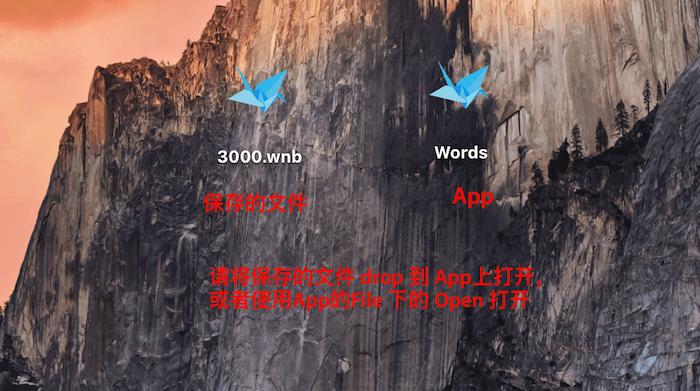

# Read Me

## 下载

[dmg下载](https://github.com/KrisYu/Words/blob/master/Words.dmg)

## 安装

[MAC如何允许安装任何来源的软件](https://blog.csdn.net/xuefujin/article/details/80264471)

## 使用

### 手动添加单词

### 导入

可导入 txt 和 csv 

- txt格式： word defination
- csv格式： word,defination

### 幻灯片样式展示单词

点击 SlideShow， 会全屏显示单词

点击回车/空格/右箭头显示释意

可以设置是否使用 Mac 语音自动朗读，是否 shuffle Words.

### 保存

文件可以保存，保存的后缀是 wnb ( Word Notebook)

### 打开保存的文件

⚠️ 请将保存的文件 drop 到 App上打开

⚠️ 或者使用App的 File 下的 Open 打开

不知道为什么，在我的机器上的几个账户测试，间歇性双击并不能加载出文件内容，但是如果使用 drop 和 File 下的 Open 一定会成功

# To do:

- [ ] 修复双击打开间歇性不加载文件内容
- [ ] 目前只支持英文/中文 -> 推广
- [ ] Localize
- [ ] 自动播放slide

